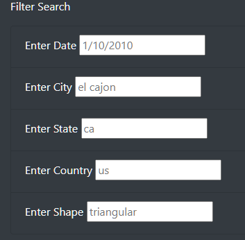
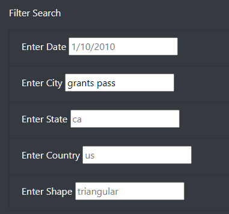
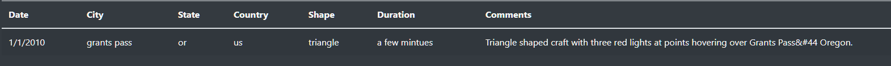

# UFOs

## Overview
The purpose of this project is to create a webpage front end to suppy the user with information about various UFO sightings. The webpage is designed so that a user could filter the data presented by Date and other parameters.

## Results
The process of using search criteria is farily straight forward:

1. User selects the criteria they would like to filter the results on: Date of sighting, city of sighting, state of sighting, country of sighting, or shape of UFO.  

3. The user enters the criteria into the respective field.  

5. The table on the right hand side is altered so that it includes only the filtered results.  

The search can be used on the site which is available [here](https://matthewshudson.github.io/UFOs/).

## Summary
A major drawback of the website currently is that when entering data into the filter search fields it is not clear what valid criteria are. For example, while it makes sense for the city field to be a text input so any city can be entered, the shape field should be a drop down menu with all the different values for shape. Along with this it would make sense to validate the user inputs to make sure they are genuine search criteria (with regex for example). Another feature that would improve the website would be integrating a map that displays the distribution of UFO sightings. 
